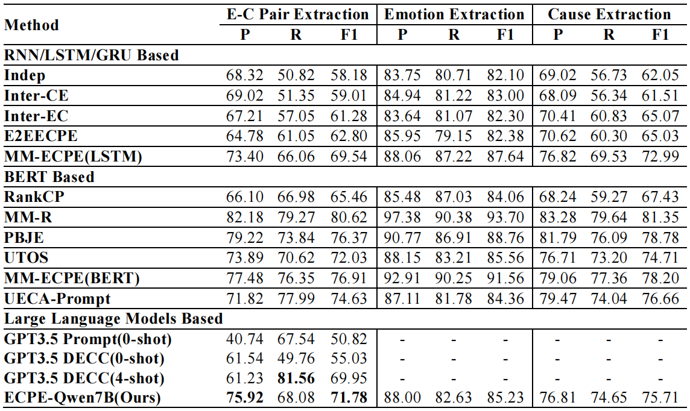
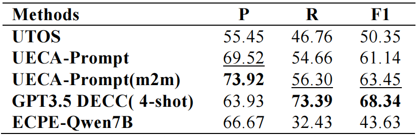
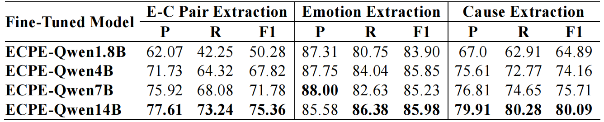
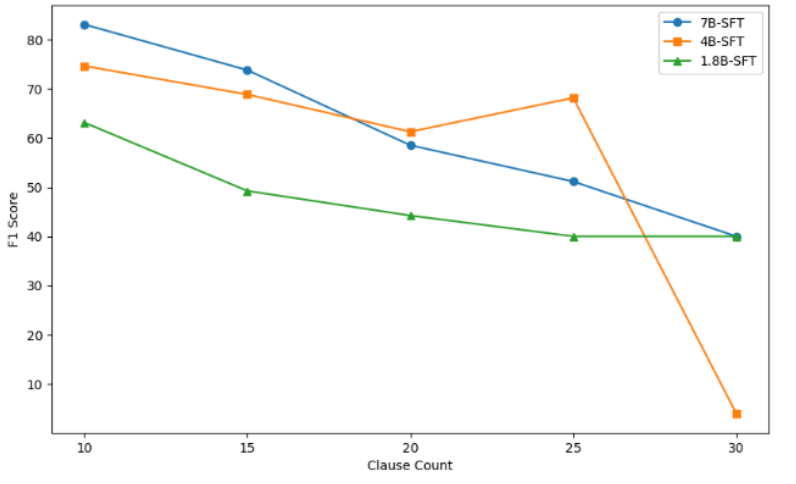
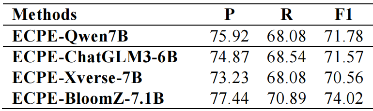

# ECPE-Qwen: Zero-Shot Emotion-Cause Pair Extraction with Fine-Tuning Large Language Models

How to get the paper: please contact with the first author [[Email](wangqiyao@mail.dlut.edu.cn)]. 

(Note： This is a Chinese paper, which has been accepted by CCIR.)

## 🔥 News
- *2024.09.01* 🥳 ECPE-Qwen is accepted by CCIR 2024.

## 👀 Overview

**ECPE-Qwen** leverages zero-shot instruction construction and low-rank adaptation (LoRA) to improve large language models (LLMs) in Emotion-Cause Pair Extraction (ECPE).

Using numeric identifier-style zero-shot instructions and a global text perspective, **ECPE-Qwen** jointly fine-tunes the Qwen1.5 model, enhancing performance in emotion, cause, and emotion-cause pair extraction. Results show it outperforms existing methods, with the 1.8B model reaching GPT-3.5 levels.

## 🙋 Usage

**Training**

script coming soon...

**Inference**

script coming soon...

**Evaluation**

script coming soon...

## 🧐 Results

The performance comparison of our method with RNN-based models, BERT-based models, and large language model-based models on the ECPE task is shown in the figure below.

### Performance of Multiple Emotion-Cause Pairs

### Performance of ECPE-Qwen Models with Different Parameter

### Performance of Different Number of Clauses

### Performance of Different Base Model

